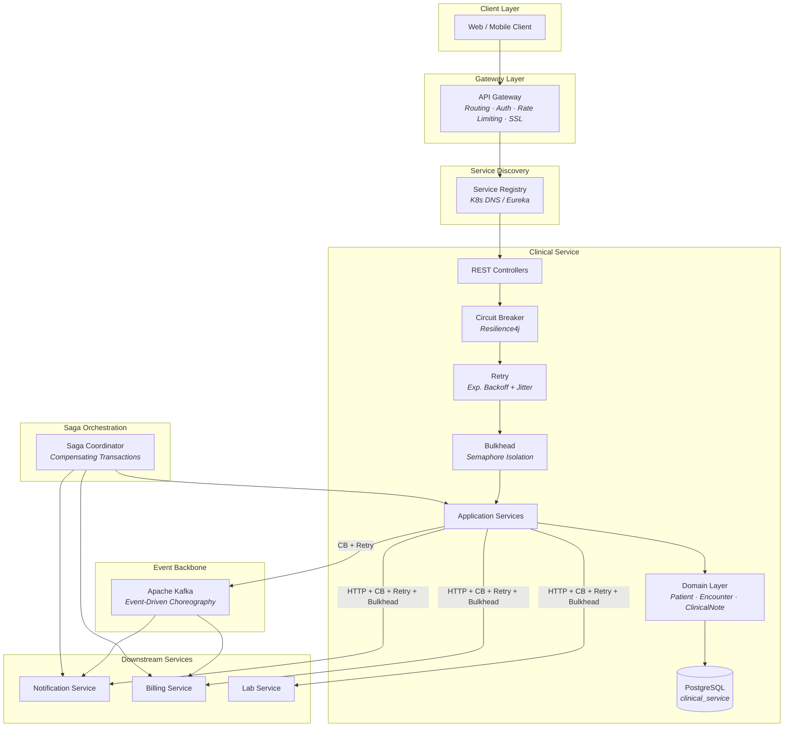
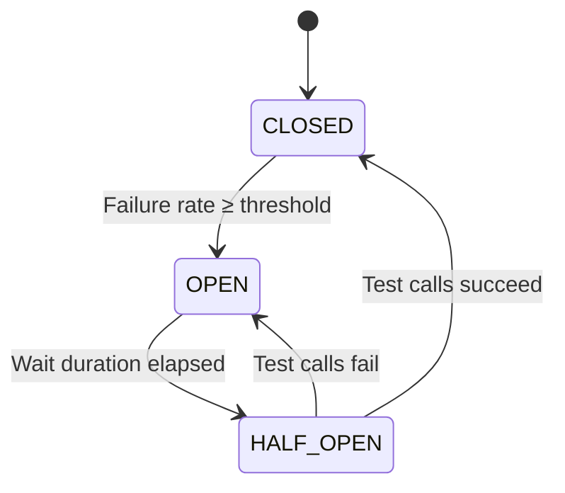
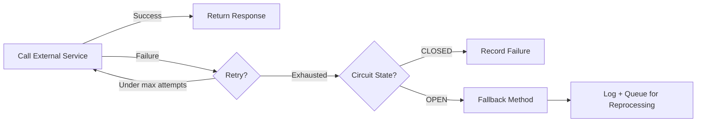

# MedTrust — Microservices Resilience Patterns

Architecture overview of how resilience and integration patterns apply to the MedTrust Healthcare Platform.

## Architecture Flow



## Pattern Mapping

| # | Pattern | MedTrust Application |
|---|---------|---------------------|
| 1 | **Circuit Breaker** | `ExternalServiceClient` + `ClinicalKafkaProducer` — opens after 50% failure rate |
| 2 | **Retry** | Exponential backoff (×2) with randomized jitter on all external calls |
| 3 | **Bulkhead** | Semaphore isolation per downstream service (10 concurrent for notifications, 5 for billing) |
| 4 | **API Gateway** | Single entry point for routing, auth, rate limiting |
| 5 | **Service Discovery** | K8s DNS-based service resolution |
| 6 | **Database per Service** | `clinical_service` PostgreSQL — schema autonomy via Flyway |
| 7 | **Saga** | Distributed transactions for patient admission → billing → notification flows |
| 8 | **Event Choreography** | Kafka domain events (`PatientAdmitted`, `EncounterCreated`, `PatientDischarged`) |
| 9 | **Orchestrator** | Saga coordinator for complex multi-step workflows (future: Temporal) |
| 10 | **Strangler** | API Gateway routes new functionality to microservices, legacy modules decommissioned |

## Resilience4j Configuration Reference

### Circuit Breaker States



### Configuration Per Instance

| Parameter | Default | notificationService | kafkaProducer |
|-----------|---------|-------------------|---------------|
| Sliding window | 10 | 10 | 5 |
| Failure rate | 50% | 50% | 60% |
| Wait in open | 30s | 30s | 15s |
| Retry attempts | 3 | 3 | 3 |
| Retry backoff | 1s × 2^n | 1s × 2^n | 500ms × 2^n |
| Max concurrent | 10 | 10 | — |

### Retry Formula

```
delay = waitDuration × exponentialBackoffMultiplier^attempt × (1 ± randomizedWaitFactor)
```

Example (notificationService, attempt 2):
```
delay = 1000ms × 2^2 × (1 ± 0.5) = 4000ms ± 2000ms = [2000ms, 6000ms]
```

## Fallback Strategy



## Anti-Patterns Avoided

| Anti-Pattern | How We Avoid It |
|---|---|
| Retry inside open circuit | Resilience4j executes retry BEFORE circuit breaker evaluates |
| Retry storms | Exponential backoff + jitter + max 3 attempts |
| Thread exhaustion | Bulkhead limits per downstream service |
| Cascading failures | Circuit breaker fast-fails + fallback methods |
| Shared database | PostgreSQL per service with Flyway migrations |
| Hidden coupling | Event-driven choreography via Kafka |
